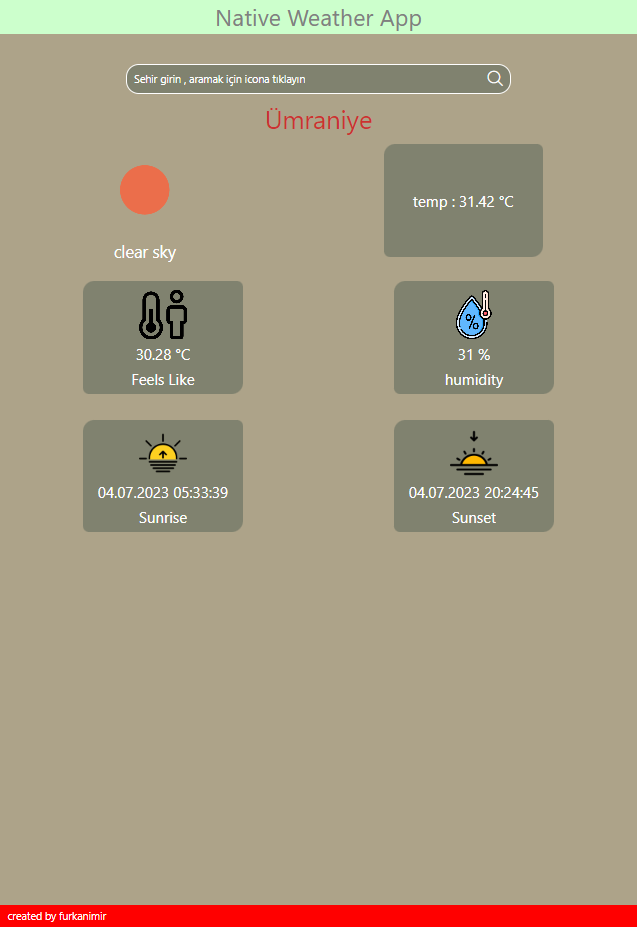

# Proje Başlığı

React Navite ile uygulama geliştirmeye başlangıç için WeatherApp yaptım.
React Native hem ios, hem android hem de web uygulamalır geliştirebileceğiniz açık kaynaklı bir JavaScript framework'üdür 

## Ekran Görüntüleri

  
## Kaynaklar
Weather Api için 'openweathermap.org' sitesini, React Native için Expo ve React dökümantasyonlarını kullandım.
